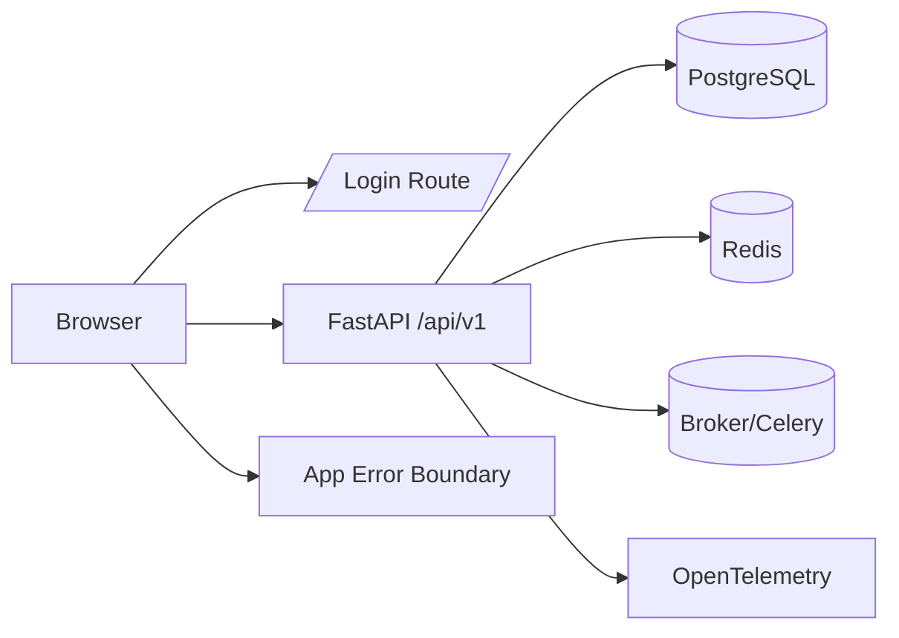

# Architecture Improvements

## Backend
- Kept the FastAPI entrypoint intact while making observability optional.
- Improved middleware failure isolation so telemetry and request logging do not crash request handling.
- Cleaned up async repository behavior and container locking.

## Frontend
- Added an explicit login surface and a top-level error boundary.
- Hardened the API client against logout loops and missing production API URLs.
- Stabilized dashboard polling and response-shape handling.

## Recommended Next Steps
- Move refresh-token revocation into Redis or PostgreSQL.
- Add a real persisted audit log stream.
- Split the dashboard bundle into lazy-loaded route chunks.

## Request Flow
